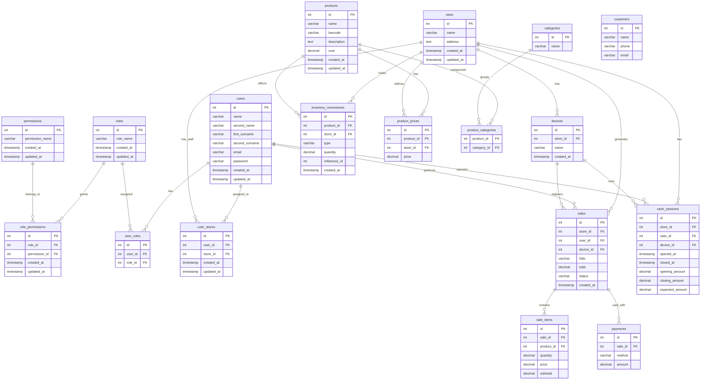

# Orb

_¡¡¡ LOGO POR DEFNIR !!!_

Sistema de Punto de Venta (POS) modular.  
Permite gestionar inventario, ventas y analíticas con un modelo simple por sucursal.

## Índice

- [Orb](#orb)
  - [Tecnologías](#tecnologías)
    - [Tauri v2](#tauri-v2-desktop-app-mobiletablet)
    - [Actix Web](#actix-web-rust-backend)
    - [Base de Datos](#base-de-datos)
      - [SQLite (Local / Offline)](#sqlite-local--offline)
      - [PostgreSQL / CockroachDB (Nube)](#postgresql--cockroachdb-nube)
    - [Tailwind CSS v4](#tailwind-css-v4)

- [Capacidades](#capacidades)
  - [Arquitectura General](#arquitectura-general)
  - [Gestión de Inventario](#gestión-de-inventario)
  - [Ventas y Lista de Compra](#ventas-y-lista-de-compra)
  - [Registro de Venta](#registro-de-venta)
  - [Gestión de Precios](#gestión-de-precios)
  - [Corte de Caja](#corte-de-caja)
  - [Reportes de Ventas](#reportes-de-ventas)
  - [Analíticas y KPIs](#analíticas-y-kpis)
  - [Alertas Inteligentes](#alertas-inteligentes)
  - [Sistema de Roles](#sistema-de-roles)
  - [Multi-Sucursal](#multi-sucursal)
  - [Gestión de SKUs](#gestión-de-skus)
  - [Experiencia de Usuario](#experiencia-de-usuario)
  - [Seguridad y Control](#seguridad-y-control)
  - [Beneficios Clave](#beneficios-clave)

- [Modelo Comercial](#modelo-comercial)
  - [Modelo de negocio](#modelo-de-negocio)
  - [Prueba Gratuita](#prueba-gratuita)
  - [Planes Disponibles](#planes-disponibles)
    - [Plan Básico Web](#plan-básico-web)
    - [Plan Web Profesional](#plan-web-profesional)
    - [Plan Completo (Web + Offline)](#plan-completo-web--offline)
  - [Capacidad adicional](#capacidad-adicional)
  - [Módulos Personalizados](#módulos-personalizados)

- [Diseño](#diseño)

- [Base de Datos](#base-de-datos-1)
  - [DB Diagram (Mermaid)](#mermaid)
  - [DB Diagram (DBML)](#dbml)

- [API](#endpoints)
  - [Versionado de API](#versionado-de-api)

  - [Auth](#auth)
  - [Tiendas](#tiendas)
  - [Users](#users)
  - [Cajas (Devices)](#cajas)
  - [Productos](#productos)
  - [Precios](#precio-de-productos)
  - [Categorías](#categorias)
  - [Inventario](#inventario)
  - [Ventas](#ventas)
  - [Pagos](#pagos)
  - [Caja (Cash Sessions)](#caja)
  - [Clientes](#clientes)
  - [Reportes](#reportes)
  - [Sync](#sync)

- [Reglas del Sistema](#notas)
  - [Endpoints Críticos](#endpoints-que-más-importan)
  - [Reglas de Oro](#reglas-de-oro)

## Tecnologías

### Tauri v2 (Desktop App, Mobile/Tablet)

#### ¿Por qué Tauri?

- Aplicación de escritorio ligera y segura
- Menor consumo de RAM comparado con Electron
- Binarios pequeños y rápidos
- Acceso a hardware local (impresoras, básculas, lectores de código)

### Actix Web (Rust Backend)

#### ¿Por qué Actix?

- Alto rendimiento y baja latencia
- Concurrencia eficiente
- Seguridad de memoria garantizada por Rust
- Excelente para APIs en tiempo real

### Base de Datos

#### SQLite (Local / Offline)

##### Uso

- Operación local en cada sucursal
- Permite ventas sin conexión
- Sin dependencia de internet

#### PostgreSQL / CockroachDB (Nube)

##### Uso

- Sincronización de datos
- Reportes globales
- Multi-sucursal
- Alta disponibilidad

##### ¿Por qué PostgreSQL?

- Estándar industrial
- Confiable y robusto
- Amplio ecosistema

##### ¿Por qué CockroachDB?

- Más barato que PostgreSQL
- Escalabilidad horizontal
- Alta tolerancia a fallos
- Ideal para crecimiento SaaS

### Tailwind CSS v4

#### ¿Por qué Tailwind?

- Desarrollo rápido de interfaces
- Consistencia visual
- Fácil soporte para tema claro/oscuro
- Diseño moderno y responsivo

## Capacidades

### Arquitectura General

- Offline-first con sincronización en la nube
- Multi-sucursal con inventarios independientes
- Sincronización segura y resiliente
- Diseño modular y escalable
- Cajas ilimitadas por sucursal
- Sistema multiusuario con roles
- Escalable por número de SKUs

### Gestión de Inventario

#### Funcionalidades
- Alta de productos nuevos
- Entrada de mercancía (aumenta stock)
- Salida de inventario (ventas, mermas, ajustes)
- Historial de movimientos
- Productos activos/inactivos
- Búsqueda rápida por nombre, código o categoría

##### Capacidades avanzadas
- Control de caducidades
- Manejo de productos por peso o fracción
- Alertas de stock bajo
- Soporte para códigos de barras

### Ventas y Lista de Compra

#### Funcionalidades

- Búsqueda rápida de productos
- Escaneo por código de barras
- Venta por unidad, peso o fracción
- Edición de cantidades en carrito
- Cálculo automático de totales
- Eliminación o modificación de productos

### Registro de Venta

- Múltiples métodos de pago
- Cálculo de cambio
- Confirmación de venta
- Generación de ticket
- Historial de transacciones

### Gestión de Precios

- Actualización individual o masiva
- Historial de precios
- Soporte para descuentos
- Precios por sucursal

### Corte de Caja

- Apertura y cierre de caja
- Conteo de efectivo
- Detección de diferencias
- Resumen diario
- Historial de cortes

### Reportes de Ventas

- Ventas diarias
- Ventas por rango de fechas
- Productos más vendidos
- Ingresos por categoría
- Exportación de reportes

### Analíticas y KPIs

- Ingresos diarios
- Ticket promedio
- Productos más vendidos
- Productos con bajo stock
- Productos próximos a caducar

### Alertas Inteligentes

- Stock bajo
- Productos caducados o próximos a caducar
- Diferencias en corte de caja

### Sistema de Roles

#### Admin

- Acceso completo
- Gestión de usuarios
- Configuración del sistema

#### Gerente

- Inventario
- Reportes y analíticas
- Corte de caja
- Gestión de precios

#### Empleado
- Ventas
- Lista de compra
- Acceso limitado al inventario

### Multi-Sucursal

#### Características
- Inventario independiente por sucursal
- Reportes individuales
- Usuarios asignados por sucursal
- Catálogo compartido opcional

### Gestión de SKUs

- Límite base de SKUs por sucursal según plan
- Expansión por bloques adicionales
- Conteo basado en productos activos

### Experiencia de Usuario

- Diseño moderno y minimalista
- Modo claro y oscuro
- Interfaz optimizada para rapidez
- Flujo de venta en pocos pasos

### Seguridad y Control

- Control de accesos por rol
- Registro de actividades
- Protección de datos por sucursal

### Beneficios Clave

- Reduce errores manuales
- Control total del inventario
- Decisiones basadas en datos
- Escalable para crecimiento del negocio

<br/>
<br/>

## Modelo Comercial

### Modelo de negocio

- Suscripción mensual por sucursal
- SKUs incluidos según plan
- Cajas y usuarios ilimitados
- Escalabilidad sin migraciones
- Creación de modulos personalizados (cotización aparte).
- Prueba gratuita de 14 días en cualquier plan

### Prueba Gratuita

**14 días gratis** en los planes:

- Básico Web
- Web Profesional 

Ventajas:
- Sin tarjeta de crédito requerida
- Cancelación sin compromiso

### Planes Disponibles

#### Plan Básico Web

**$50 MXN / mes por sucursal**

Diseñado para negocios muy pequeños que solo necesitan registrar ventas.

| Característica | Detalle           |
|----------------|-------------------|
| Plataforma     | Solo Web          |
| SKUs incluidos | 100 productos     |
| Cajas          | 1                 |
| Usuarios       | Ilimitados        |
| Analíticas     | No incluidas      |
| Reportes       | No disponibles    |
| Offline        | No disponible     |

Enfocado a:

- Tiendas pequeñas
- Emprendimientos
- Validación inicial

#### Plan Web Profesional
**$200 MXN / mes por sucursal**

Para negocios que necesitan control y reportes básicos.

| Característica | Detalle                 |
|----------------|-------------------------|
| Plataforma     | Solo Web                |
| SKUs incluidos | 200 productos           |
| Cajas          | 2                       |
| Usuarios       | Ilimitados              |
| Analíticas     | Incluidas               |
| Reportes       | Dentro de la plataforma |
| Offline        | No disponible           |

Enfocado a:

- Abarrotes pequeños
- Fruterías
- Carnicerías

#### Plan Completo (Web + Offline)
**$350 MXN / mes por sucursal**

Solución completa para negocios que requieren confiabilidad y control total.

| Característica | Detalle                                |
|----------------|----------------------------------------|
| Plataforma     | Web + Offline                          |
| SKUs incluidos | 350 productos                          |
| Cajas          | Ilimitadas                             |
| Usuarios       | Ilimitados                             |
| Analíticas     | Avanzadas                              |
| Reportes       | Generación y automatización por correo |
| Offline        | Disponible                             |

#### Capacidad adicional

| Concepto         | Precio                        |
|------------------|-------------------------------|
| SKUs adicionales | +$150 MXN por cada 1,000 SKUs |


Enfocado a:
- Ferreterías
- Carnicerías grandes
- Tiendas con múltiples cajas

#### Módulos Personalizados

Módulos a medida que se integran directamente al sistema

Ejemplos:

- Integración con básculas electrónicas
- Facturación electrónica (CFDI)
- Control de crédito a clientes
- Gestión de proveedores
- Compras automáticas
- Integración con tiendas en línea
- Reportes avanzados personalizados

##### Modelo de costo

| Concepto               | Precio                    |
|------------------------|---------------------------|
| Desarrollo de módulo   | Cotización única          |
| Mantenimiento opcional | Desde $100–$200 MXN / mes |

## Diseño

- [Link a v0](https://v0.app/chat/pos-web-app-prototype-iG0NjWlUP98?ref=95EMM0)
- [Link al Figma](https://www.figma.com/design/OT0VbJSVSTSG4VgwCJx7v3/Orb_POS?node-id=0-1&t=h7CY2Qr5aBGQZ9ZA-1)

<br/>

## Db diagram

### Mermaid



### Dbml
<details>
<summary>DB Diagram</summary>

```dbdiagram
// Permisos individuales del sistema 
// (ej: crear venta, editar inventario)
Table permissions {
  id int [pk]
  permission_name varchar [not null]
  created_at timestamp [default: `CURRENT_TIMESTAMP`]
  updated_at timestamp
}

// Roles del sistema (Admin, Gerente, Empleado)
Table roles {
  id int [pk]
  role_name varchar [not null]
  created_at timestamp [default: `CURRENT_TIMESTAMP`]
  updated_at timestamp
}

// Relación muchos a muchos entre roles y permisos
Table role_permissions {
  id int [pk]
  role_id int [ref: > roles.id]
  permission_id int [ref: > permissions.id]
  created_at timestamp [default: `CURRENT_TIMESTAMP`]
  updated_at timestamp
}

// Usuarios del sistema (empleados, administradores, etc.)
Table users {
  id int [pk]
  name varchar [not null]
  second_name varchar
  first_surname varchar
  second_surname varchar
  email varchar [not null]
  password varchar [not null]
  created_at timestamp [default: `CURRENT_TIMESTAMP`]
  updated_at timestamp
}

// Relación muchos a muchos entre usuarios y roles 
// (permite múltiples roles por usuario)
Table user_roles {
  id int [pk]
  user_id int [ref: > users.id]
  role_id int [ref: > roles.id]
}

// Sucursales del negocio (cada tienda física o ubicación)
Table store {
  id int [pk]
  name varchar [not null]
  address text
  created_at timestamp [default: `CURRENT_TIMESTAMP`]
  updated_at timestamp
}

// Relación entre usuarios y sucursales 
// (dónde puede trabajar cada usuario)
Table user_stores {
  id int [pk]
  user_id int [ref: > users.id]
  store_id int [ref: > store.id]
  created_at timestamp [default: `CURRENT_TIMESTAMP`]
  updated_at timestamp
}

// Dispositivos o cajas dentro de una sucursal (ej: Caja 1, Caja 2)
Table devices {
  id int [pk]
  store_id int [ref: > store.id]
  name varchar
  created_at timestamp [default: `CURRENT_TIMESTAMP`]
}

// Categorías de productos (para organización y reportes)
Table categories {
  id int [pk]
  name varchar
}

// Catálogo global de productos (sin stock ni precio por sucursal)
Table products {
  id int [pk]
  name varchar [not null]
  barcode varchar [unique]
  description text
  cost decimal(10,2)
  created_at timestamp [default: `CURRENT_TIMESTAMP`]
  updated_at timestamp
}

// Precio de productos por sucursal 
// (permite diferentes precios por tienda)
Table product_prices {
  id int [pk]
  product_id int [ref: > products.id]
  store_id int [ref: > store.id]
  price decimal(10,2)
}

// Relación entre productos y categorías (muchos a muchos)
Table product_categories {
  product_id int [ref: > products.id]
  category_id int [ref: > categories.id]
}

// Historial de movimientos de inventario 
// (fuente real del stock)
Table inventory_movements {
  id int [pk]
  product_id int [ref: > products.id]
  store_id int [ref: > store.id]
  type varchar // sale, purchase, adjustment, loss
  quantity decimal(10,2)
  reference_id int // referencia a venta u operación
  created_at timestamp [default: `CURRENT_TIMESTAMP`]
}

// Registro principal de ventas realizadas
Table sales {
  id int [pk]
  store_id int [ref: > store.id]
  user_id int [ref: > users.id]
  device_id int [ref: > devices.id]
  folio varchar // número de ticket
  total decimal(10,2)
  status varchar // completed, cancelled
  created_at timestamp [default: `CURRENT_TIMESTAMP`]
}

// Detalle de productos vendidos en cada venta
Table sale_items {
  id int [pk]
  sale_id int [ref: > sales.id]
  product_id int [ref: > products.id]
  quantity decimal(10,2)
  price decimal(10,2)
  subtotal decimal(10,2)
}

// Métodos de pago utilizados en una venta 
// (permite pagos mixtos)
Table payments {
  id int [pk]
  sale_id int [ref: > sales.id]
  method varchar // cash, card, transfer
  amount decimal(10,2)
}

// Sesiones de caja (apertura y cierre de caja por usuario/dispositivo)
Table cash_sessions {
  id int [pk]
  store_id int [ref: > store.id]
  user_id int [ref: > users.id]
  device_id int [ref: > devices.id]
  opened_at timestamp
  closed_at timestamp
  opening_amount decimal(10,2)
  closing_amount decimal(10,2)
  expected_amount decimal(10,2)
}

// Clientes del sistema (para historial, crédito o facturación futura)
Table customers {
  id int [pk]
  name varchar
  phone varchar
  email varchar
}
```
</details>


## Endpoints

Esto es solo un listado de los endpoints que se necesitarian

### Versionado de API

Importante por si hay cambios internos que pueden afectar al usuario

```
/api/v1
```

### Auth

#### POST /auth/login

Autentica usuario y devuelve token + contexto (stores, roles)

Tablas: 
- users
- user_roles
- roles
- user_stores

Notas:
- Validar password
- Devolver stores asignadas
- Ideal incluir device_id si es POS

#### GET /auth/me

Obtiene info del usuario autenticado

Tablas:
- users
- user_roles
- roles
- user_stores

Notas:
- Se usa para reconstruir sesión

#### POST /auth/logout

Cierra sesión

### Tiendas

#### GET /stores

Lista sucursales del usuario

Tablas: 
- store
- user_stores

#### GET /stores/:id

Detalle de sucursal

Tablas:
- store

### Users

#### GET /users

Lista usuarios de la sucursal

Tablas:
- users
- user_stores

#### POST /users

Crear usuario

Tablas:
- users
- user_roles
- user_stores

Notas:
- Asignar rol y sucursal

#### PATCH /users/:id

Editar usuario

Tablas:
- users
- user_roles

### Cajas

#### GET /devices

Lista cajas de una sucursal

Tablas:
- devices

#### POST /devices

Crear nueva caja

Tablas:
- devices

### Productos

#### GET /products

Lista catálogo

Tablas:
- products

#### POST /products

Crear producto

Tablas:
- products
- product_prices
- product_categories

#### PATCH /products/:id

Editar producto

Tablas:
- products

#### GET /products/search?q=

Búsqueda rápida (nombre o código)

Tablas:
- products
- product_prices

Notas:
- Endpoint MÁS crítico en POS
- Debe ser ultra rápido

#### GET /products/barcode/:barcode

Buscar producto por código de barras

Tablas:
- products
- product_prices

### Precio de productos

#### PUT /products/:id/price

Actualizar precio por sucursal

Tablas:
- product_prices

Notas:
- No modificar products

#### GET /stores/:store_id/prices

Obtener precios de la sucursal

Tablas:
- product_prices
- products

### Categorias

#### GET /categories

Listar categorías

Tablas:
- categories

#### POST /categories

Crear categoría

Tablas:
- categories

#### PUT /categories

Actualizar categorias

Tablas:
- categories

### Inventario

#### POST /inventory/adjust

Ajuste manual de inventario

Tablas:
- inventory_movements

Notas:
- Nunca modificar stock directo
- Crear movimiento tipo adjustment

#### POST /inventory/entry

Entrada de mercancía (compra)

Tablas:
- inventory_movements

Notas:
- type = purchase

#### POST /inventory/loss

Registrar merma

Tablas:
- inventory_movements

Notas:
- type = loss

#### GET /inventory/movements

Historial de movimientos

Tablas:
- inventory_movements

#### GET /inventory/stock

Stock actual por producto

Tablas:
- inventory_movements

Notas:
- Calcular SUM dinámico o usar cache

### Ventas

#### POST /sales

Crear venta completa

Tablas:
- sales
- sale_items
- payments
- inventory_movements

Notas:
- Calcular precios (NO confiar en frontend)
- Generar folio
- Validar stock
- Crear movimientos tipo sale
- Transacción atómica

#### GET /sales

Listar ventas

Tablas:
- sales

Filtros:
- fecha
- store_id

#### GET /sales/:id

Detalle de venta

Tablas:
- sales
- sale_items
- payments

#### POST /sales/:id/cancel

Cancelar venta

Tablas:
- sales
- inventory_movements

Notas:
- Revertir inventario
- Marcar status = cancelled

### Pagos

#### GET /sales/:id/payments

Ver pagos de una venta

Tablas:
- payments

### Caja

#### POST /cash-sessions/open

Abrir caja

Tablas:
- cash_sessions

#### POST /cash-sessions/:id/close

Cerrar caja

Tablas:
- cash_sessions
- sales

Notas:
- Calcular expected_amount basado en ventas

#### GET /cash-sessions/current

Obtener sesión activa

Tablas:
- cash_sessions

#### GET /cash-sessions

Historial de cortes

Tablas:
- cash_sessions

### Clientes

#### GET /customers

Listar clientes

Tablas:
- customers

#### POST /customers

Crear cliente

Tablas:
- customers

### Reportes

Básicos

#### GET /reports/sales/daily

Ventas del día

Tablas:
- sales

#### GET /reports/sales/range

Ventas por rango

Tablas:
- sales

#### GET /reports/top-products

Productos más vendidos

Tablas:
- sale_items
- products

### Sync

#### POST /sync/push

Subir datos locales al servidor

Tablas:
- sales
- inventory_movements

Notas:
- append-only
- usar idempotencia

#### GET /sync/pull

Descargar cambios del servidor

Tablas:
- products
- product_prices

### Notas

#### ENDPOINTS QUE MÁS IMPORTAN

```
/sales

/products/search

/cash-sessions/open

/cash-sessions/close

/inventory/adjust
```

####  REGLAS DE ORO
1. Ventas = inmutables
- no se editan
- solo cancelar

2. Inventario = eventos
- no hay update directo
- todo pasa por movements

3. Backend manda
- precios
- totales
- validaciones

4. Transacciones SIEMPRE

Especialmente en:

```
/sales
/sales/cancel
```

# Roadmap

Se organizo un Roadmap a base de colores para que sea de "facil" identificación.

## 🟢 FASE 0 — Fundaciones (Infraestructura base)

### Objetivo
Tener backend corriendo, auth funcional y base del sistema lista.

### Features

#### 1. Autenticación básica
Sistema de login + sesión

**Endpoints:**
- `POST /auth/login`
- `GET /auth/me`
- `POST /auth/logout`

#### 2. Modelo de usuarios + roles

**Endpoints:**
- `GET /users`
- `POST /users`
- `PATCH /users/:id`

#### 3. Sucursales (multi-store base)

**Endpoints:**
- `GET /stores`
- `GET /stores/:id`

### Notas
- Aquí definimos JWT + middleware
- No complicarse con permisos aún → solo roles
- Esto desbloquea todo lo demás

---

## 🟡 FASE 1 — Catálogo de productos

### Objetivo
Poder crear productos y consultarlos rápido (core del POS)

### Features

#### 1. CRUD de productos

**Endpoints:**
- `GET /products`
- `POST /products`
- `PATCH /products/:id`

#### 2. Búsqueda rápida (CRÍTICO)

**Endpoints:**
- `GET /products/search?q=`
- `GET /products/barcode/:barcode`

#### 3. Categorías

**Endpoints:**
- `GET /categories`
- `POST /categories`

#### 4. Precios por sucursal

**Endpoints:**
- `PUT /products/:id/price`
- `GET /stores/:store_id/prices`

### Notas
> Este es el endpoint más importante del sistema: **`/products/search`**
>
> Optimízarlo desde el día 1 (índices, LIKE, etc.)

- Aquí aún **NO** se maneja stock

---

## 🟠 FASE 2 — Inventario (la base real del negocio)

### Objetivo
Tener control real de stock basado en eventos

### Features

#### 1. Movimientos de inventario

**Endpoints:**
- `POST /inventory/entry` (compra)
- `POST /inventory/adjust` (ajuste manual)
- `POST /inventory/loss` (merma)

#### 2. Consulta de inventario

**Endpoints:**
- `GET /inventory/movements`
- `GET /inventory/stock`

### Notas (MUY importantes)
- **NO** guardar stock directo en `products`
- Todo sale de `inventory_movements`

Esto nos salva de:
- bugs
- inconsistencias
- dolores de cabeza

---

## 🔴 FASE 3 — Ventas (MVP funcional)

### Objetivo
Ya vender en vida real

### Features

#### 1. Crear venta completa

**Endpoint clave:**
- `POST /sales`

#### 2. Consultar ventas
- `GET /sales`
- `GET /sales/:id`

#### 3. Cancelación
- `POST /sales/:id/cancel`

#### 4. Pagos
- `GET /sales/:id/payments`

### Notas críticas
> Este endpoint debe ser **transaccional**

Validaciones:
- stock
- precios
- totales

Genera:
- `sale`
- `sale_items`
- `payments`
- `inventory_movements`

---

## 🟣 FASE 4 — Caja (operación real de tienda)

### Objetivo
Controlar dinero real (apertura/cierre)

### Features

#### 1. Apertura de caja
- `POST /cash-sessions/open`

#### 2. Cierre de caja
- `POST /cash-sessions/:id/close`

#### 3. Estado actual
- `GET /cash-sessions/current`

#### 4. Historial
- `GET /cash-sessions`

### Notas
- Calcular `expected_amount` automáticamente
- Esto conecta ventas + dinero físico

---

## 🔵 FASE 5 — Dispositivos (cajas físicas)

### Objetivo
Soportar múltiples cajas por tienda

### Features

#### 1. Gestión de dispositivos
- `GET /devices`
- `POST /devices`

### Notas
- Cada venta debe tener `device_id`
- Esto habilita: auditoría y multi-caja real

---

## 🟤 FASE 6 — Clientes

### Objetivo
Prepararnos para features futuras (crédito, facturación)

### Features
- `GET /customers`
- `POST /customers`

### Notas
- No sobrepensar por el momento
- Es base para: CFDI, historial, lealtad

---

## ⚫ FASE 7 — Reportes (insights básicos)

### Objetivo
Dar valor real al negocio

### Features

#### 1. Reportes de ventas
- `GET /reports/sales/daily`
- `GET /reports/sales/range`

#### 2. Productos top
- `GET /reports/top-products`

### Notas
- Aquí se pueden usar agregaciones SQL
- No necesitamos BI complejo aún

---

## ⚪ FASE 8 — Sync (modo offline real)

### Objetivo
Convertirte en un POS serio

### Features

#### 1. Subida de datos
- `POST /sync/push`

#### 2. Descarga de cambios
- `GET /sync/pull`

### Notas
Usa:
- timestamps
- versionado
- idempotencia

Modelo: `local (SQLite)` → `cloud` → `otros dispositivos`

---


Sí, ventas antes que inventario completo, porque:
- podemos simular stock al inicio
- validamos el UX rápido

---

## MVP

| Feature | Fase |
|---|---|
| Auth | 0 |
| Productos + búsqueda | 1 |
| Ventas | 3 |
| Caja básica | 4 |

> Con eso ya deberiamos poder cobrar algo

---

## Errores que evitar

- Hacer sync demasiado pronto
- Sobre-diseñar roles/permisos
- Meter reportes complejos temprano
- No hacer transacciones en `/sales`
- Guardar stock como columna en `products`